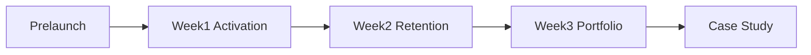

# PA Analytics — Palph Portfolio

Эта папка — рабочее пространство для продуктовой аналитики после релиза Palph.
Цель: превратить бота в **реальный PA-кейс** для портфолио (activation, retention,
feature adoption, рекомендации).

## Быстрый старт

```bash
pip install -r requirements-dev.txt

# 1. До релиза — проверить, что аналитика и экспорт работают
python scripts/pa_verify_export.py

# 2. После релиза — еженедельный снимок данных + markdown-сводка
python scripts/pa_weekly_snapshot.py

# 3. Jupyter-ноутбуки для графиков и case study
jupyter notebook analysis/
```

## Структура

| Путь | Назначение |
|------|------------|
| [product_framework.md](product_framework.md) | Цели, гипотезы, метрики, события |
| [analytics_logbook.md](analytics_logbook.md) | Ежедневный/еженедельный лог решений |
| [acquisition_tracker.md](acquisition_tracker.md) | Каналы привлечения и посты |
| [prelaunch/export_checklist.md](prelaunch/export_checklist.md) | Чеклист перед публичным запуском |
| [week1/](week1/) | Неделя 1: activation funnel |
| [week2/](week2/) | Неделя 2: retention + опрос про планирование |
| [week3/](week3/) | Неделя 3: case study и портфолио |
| [lib/](lib/) | Python-хелперы для ноутбуков |
| [exports/](exports/) | ZIP/CSV выгрузки (`/export all`) |
| `01_cohort_retention.ipynb` | Retention heatmap |
| `02_activation_funnel.ipynb` | Activation funnel + time-to-value |
| `03_feature_adoption.ipynb` | Feature adoption vs retention |
| `04_session_patterns.ipynb` | Heatmap часов × дней недели |

## Админ-команды бота (источник данных)

См. [admin_commands.md](../admin_commands.md):

- `/analytics` — dashboard с inline-меню
- `/funnel`, `/activation`, `/product_metrics`, `/cohort_stats`
- `/feature_usage`, `/segments`, `/dau`, `/heatmap`
- `/export all` — ZIP всех таблиц + `metadata.json`

## Workflow по неделям



### Prelaunch
1. Заполнить [product_framework.md](product_framework.md)
2. Прогнать [export_checklist.md](prelaunch/export_checklist.md)
3. Сохранить baseline: `python scripts/pa_verify_export.py --save-baseline`

### Week 1
- Ежедневно: `/funnel`, `/activation`, `/dau`
- В конце недели: `python scripts/pa_weekly_snapshot.py --week 1`
- Заполнить [week1/report_template.md](week1/report_template.md)

### Week 2
- `/cohort_stats`, `/feature_usage`, `/segments`
- Опубликовать [week2/planning_poll_post.md](week2/planning_poll_post.md)
- Заполнить [week2/report_template.md](week2/report_template.md)

### Week 3
- Прогнать ноутбуки 01–04
- Заполнить [week3/case_study_template.md](week3/case_study_template.md)
- Обновить [week3/product_decision_log.md](week3/product_decision_log.md)

## Целевые артефакты для резюме

1. **Case study** — 1 страница: проблема → данные → инсайты → рекомендации
2. **4 графика** — retention, funnel, feature adoption, session patterns
3. **Product decision log** — 5–10 решений с обоснованием
4. **Resume bullet** — см. [week3/resume_bullets.md](week3/resume_bullets.md)

## Минимальные цели на 3 недели

| Метрика | Минимум | Хорошо |
|---------|---------|--------|
| Регистрации | 30 | 50+ |
| Activation 24h | измерить | ≥40% |
| D7 retention | измерить | ≥20% |
| Feature adoption | ≥3 фичи с данными | все 14 фич |

---

## Синхронизация с кодом

| Поле | Значение |
|------|----------|
| Версия бота | v0.8 |
| Doc sync | 2026-09-05 |
| Pytest suite | **793** tests (`pytest --collect-only -q`) |
| User flows | [user-flows.md](../user-flows.md) |
| Session log | [session_notes.md](../session_notes.md) |

Экспорты в [exports/](exports/) и сводки `weekly_summary.md` — **снимки данных**;
не перезаписывать при doc-sync, только новые прогоны `pa_weekly_snapshot.py`.
