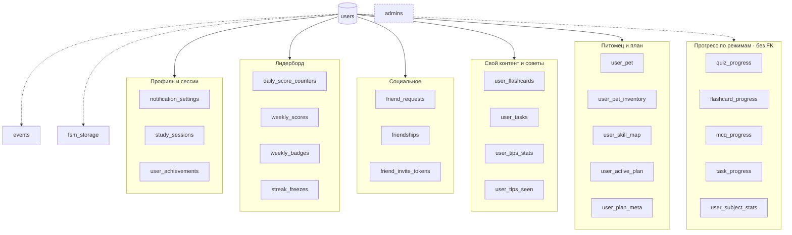

# Модель данных

> **Doc sync:** 2026-09-05 · схема — `db.py::init_db` · **28 таблиц**, **14 индексов**.

Единственное хранилище — SQLite-файл (`DB_PATH`, по умолчанию
`studybuddy.db`, в контейнере `/app/data/studybuddy.db`).

Режим: `journal_mode=WAL`, `foreign_keys=ON`, `busy_timeout=5000`.
Все таймстемпы — TEXT в UTC-подобном формате SQLite (`datetime('now')`),
кроме календарных ключей лидерборда, которые хранятся **в локальном TZ
пользователя** (`local_date`, `week_iso`) — это осознанное решение, см.
[LEADERBOARD.md](../LEADERBOARD.md).

## Карта таблиц

28 таблиц проще держать в голове как шесть кластеров вокруг `users`.
Стрелка — внешний ключ на `users(user_id)` с `ON DELETE CASCADE`;
пунктир — связь по `user_id` **без** FK (такие таблицы удаляются вручную,
см. §«Удаление данных пользователя»).

`admins` ни с чем не связана — это отдельный список идентификаторов.
`events` и `fsm_storage` тоже без FK: первая append-only и переживает
пользователя до явного удаления, вторая адресуется составным TEXT-ключом.

## Обзор таблиц

| # | Таблица | Назначение | Экспорт `/export` |
|---|---------|-----------|:-----------------:|
| 1 | `users` | Профиль, монеты, стрик, TZ, локаль, privacy | `users` |
| 2 | `notification_settings` | Напоминания, ачивки, источник карточек | `settings` |
| 3 | `study_sessions` | История Pomodoro-сессий + оценка | `sessions` |
| 4 | `user_achievements` | Прогресс по 10 ачивкам | `achievements` |
| 5 | `quiz_progress` | Ситуационные квизы, фикс-интервалы | `quiz` |
| 6 | `flashcard_progress` | SM-2 состояние карточек | `flashcards` |
| 7 | `mcq_progress` | Попытки по MCQ-вопросам | `mcq` |
| 8 | `task_progress` | Попытки по задачам | `tasks` |
| 9 | `user_subject_stats` | Заходы и последняя активность по предмету | `subject_stats` |
| 10 | `events` | Append-only лог продуктовых событий | `events` |
| 11 | `admins` | Список админов | — |
| 12 | `fsm_storage` | Persistent FSM aiogram | — |
| 13 | `user_pet` | Питомец: имя, цвет, аксессуар, level, xp | `pet` |
| 14 | `user_pet_inventory` | Купленные предметы | `pet_inventory` |
| 15 | `daily_score_counters` | Дневные капы лидерборда | — |
| 16 | `weekly_scores` | Недельные суммы по компонентам | `weekly_scores` |
| 17 | `streak_freezes` | Покупки и расход заморозок стрика | `streak_freezes` |
| 18 | `weekly_badges` | Награды за неделю с истечением | `weekly_badges` |
| 19 | `friend_requests` | Заявки в друзья (только pending) | `friend_requests` |
| 20 | `friendships` | Подтверждённые дружбы | `friendships` |
| 21 | `friend_invite_tokens` | Deep-link инвайты | — |
| 22 | `user_flashcards` | Свои карточки пользователя | `user_flashcards` |
| 23 | `user_tasks` | Свои задачи (импорт из `.txt`) | — |
| 24 | `user_tips_stats` | Счётчик советов, совет дня | `tips_stats` |
| 25 | `user_tips_seen` | Показанные советы (cooldown) | `tips_seen` |
| 26 | `user_skill_map` | Карта навыков для спринт-плана | — |
| 27 | `user_active_plan` | Сгенерированный 14-дневный план | — |
| 28 | `user_plan_meta` | UX-флаги онбординга плана | — |

Экспортируемых алиасов ровно **20** (`AnalyticsService.EXPORTABLE_TABLES`).
Не экспортируются: `admins` и `fsm_storage` (операционные),
`daily_score_counters` и `friend_invite_tokens` (эфемерные),
`user_tasks` и три таблицы плана (фича выключена).

## Ядро

### `users`

| Колонка | Тип | Заметки |
|---------|-----|---------|
| `user_id` | INTEGER PK | Telegram user id |
| `timezone` | TEXT NOT NULL | IANA, дефолт `Europe/Moscow`; управляет стриками, напоминаниями, календарными ключами |
| `total_sessions` | INTEGER | Счётчик завершённых сессий |
| `total_coins` | INTEGER | Баланс монет |
| `current_streak` | INTEGER | Дней подряд |
| `last_session` | TEXT | Таймстемп последней сессии |
| `has_studied_today` | INTEGER | Флаг для ночной обработки стриков |
| `created_at` | TEXT | Точка отсчёта когорт и сегмента newbie/main |
| `hidden_from_leaderboards` | INTEGER | *миграция*, privacy opt-out |
| `username` | TEXT NULL | *миграция*, синхронизируется middleware |
| `last_streak_check_date` | TEXT NULL | *миграция*, идемпотентность ночного прогона |
| `locale` | TEXT NOT NULL DEFAULT `''` | *миграция*, `ru`/`en`; пусто = язык ещё не выбран |

### `notification_settings`

`morning_enabled`/`morning_time` (дефолт `09:00`),
`evening_enabled`/`evening_time` (дефолт `21:00`), `streak_enabled`,
`achievements_enabled`, `flashcard_source` (`mix` | `official` | `own`).
FK на `users` с `ON DELETE CASCADE`.

### `study_sessions`

`duration_minutes`, `coins_earned`, `bonus_coins`, `score` (1..4 —
эмодзи-оценка пользователя, NULL = не оценено), `created_at`.
Индексы: `idx_sessions_user_id`, `idx_sessions_created_at`.

## Прогресс по режимам учёбы

Четыре режима — четыре независимые таблицы прогресса; «mastered» считается
по-разному (это важно для экрана прогресса и `content_stats`):

| Таблица | Ключ | Что значит «освоено» |
|---------|------|----------------------|
| `quiz_progress` | `(user_id, term_hash)` | `streak >= 3` |
| `flashcard_progress` | `(user_id, card_hash)` | `repetitions >= 3` |
| `mcq_progress` | `(user_id, question_hash)` | `correct_count >= 1` |
| `task_progress` | `(user_id, task_id)` | `succeeded = 1` |

**Хеши контента** (стабильные идентификаторы без отдельной таблицы контента):

- официальная карточка: `md5(term)[:8]`
- **своя** карточка: `u{card_id:07x}` — пространство имён не пересекается с официальным
- MCQ-вопрос: `md5(question)[:8]`
- ситуационный термин: `md5(term)[:8]`
- задача: `task-NN` (официальная) или `u{db_id:07x}` (своя)

`flashcard_progress` держит SM-2 состояние: `ease_factor` (старт 2.5, пол
1.3), `interval_days`, `repetitions`, `last_review`, `next_review`.
Индекс `idx_flashcard_user_next (user_id, next_review)` — выборка «что
сегодня к повторению».

## Лидерборд

### `daily_score_counters` — PK `(user_id, local_date)`

Внутридневное состояние капов: `time_minutes` / `time_pts` (кусочно-линейное
начисление), `task_count` (кап 5), `quiz_count` (кап 25) +
`quiz_series_running` (серия для бонуса +15 за каждые 3 подряд),
`cards_count` (кап 8). Новый день = новая строка, поэтому счётчики и серия
обнуляются естественным образом, без cron-джобы.

### `weekly_scores` — PK `(user_id, week_iso)`

`time_pts` REAL, `task_pts`, `quiz_pts`, `card_pts` INTEGER.
Множитель стрика **не хранится** — применяется на чтении из
`users.current_streak` (`services.streak_multiplier`). Индекс
`idx_weekly_scores_week` для ранжирования сегмента.

### `streak_freezes` — PK `(user_id, granted_at)`

`streak_at_grant` (аудит), `cost_paid` (500/750/1000),
`consumed_for_date` (NULL = ещё не израсходована). Частичный индекс
`idx_freezes_user_unused … WHERE consumed_for_date IS NULL` — быстрый поиск
активной заморозки. Кулдаун: `MAX(granted_at) < now - 7 days`.

### `weekly_badges` — PK `(user_id, badge_id, awarded_for_week)`

`badge_id ∈ {top_1, top_2, top_3, breakthrough, top10_pct_bonus}`,
`awarded_at`, `expires_at` (обычно +7 дней). PK делает `run_rollover`
идемпотентным: повторный запуск не выдаёт дубли и не начисляет монеты второй раз.

## Социальный слой

- `friend_requests` — только **pending**; на accept строка удаляется и
  появляется дружба, на reject/cancel просто удаляется. PK `(from, to)`
  предотвращает дубли, `CHECK (from != to)` — заявку самому себе.
- `friendships` — нормализовано: **всегда `user_a < user_b`**, одна строка
  на дружбу, `CHECK (user_a < user_b)`. Проверка «дружат ли A и B» — один
  lookup по нормализованной паре.
- `friend_invite_tokens` — multiuse deep-link `t.me/<bot>?start=friend_<token>`,
  `expires_at = created_at + 3 дня`. Клик по ссылке создаёт дружбу сразу,
  без pending: ссылка = согласие автора, клик = согласие приглашённого.

> В комментарии `db.py` к `friend_invite_tokens` указан TTL 3 дня; README
> исторически упоминал 30 дней — верное значение **3 дня**, см.
> `FriendRepository.create_invite_token`.

## Пользовательский контент

- `user_flashcards` — `UNIQUE (user_id, subject_id, term)`, лимит 100 карт
  на предмет (`UserFlashcardRepository.MAX_PER_SUBJECT`), индекс
  `(user_id, subject_id)`.
- `user_tasks` — `problem`, `accepted` (JSON-массив принимаемых ответов),
  `hint`; импорт из `.txt`, лимит 50 задач на предмет
  (`UserTaskRepository.MAX_PER_SUBJECT`), файл ≤ 64 КБ
  (`USER_TASK_FILE_MAX_BYTES`).

## Питомец

- `user_pet` — один питомец на пользователя: `name`, `color`, `accessory`
  (sentinel `none` вместо NULL), `level`, `xp`, `last_excited_at`.
  Эмоция **не хранится** — выводится в момент рендера
  (`services.derive_emotion`).
- `user_pet_inventory` — PK `(user_id, item_type, item_value)`, что делает
  покупку идемпотентной через `INSERT OR IGNORE`. При создании питомца
  сидится двумя бесплатными дефолтами: `(color, orange)` и `(accessory, none)`.

## Советы

- `user_tips_stats` — `total_views`, `last_coin_date` (монета раз в день),
  `tip_of_day_id` + `tip_of_day_date` (*миграция*).
- `user_tips_seen` — PK `(user_id, tip_id)` + индекс по времени; даёт
  cooldown 7 дней на повтор совета.

## Спринт-план (выключен)

`user_skill_map` (бинарный навык по теме), `user_active_plan`
(`plan_json` + `day_minutes` + `logical_day`), `user_plan_meta`
(`diagnostic_done`, `first_prompt_shown`, `skip_plan_prompt`).
Схема создаётся всегда, UI закрыт флагом `PLAN_UI_ENABLED = False`.

## События

`events` — append-only, никаких UPDATE/DELETE:
`id`, `user_id` (nullable), `event_name`, `properties` (JSON-строка),
`created_at`, плюс денормализованные колонки `subject_id`, `mode`, `tip_id`
(*миграция*) для быстрых SQL/pandas-срезов.
Индексы: `idx_events_user_time`, `idx_events_name_time`.
Полная таксономия — [analytics.md](analytics.md).

## Служебные

- `admins` — единственная колонка `user_id`. Источник истины — БД, `bot.py`
  держит in-memory `set` для синхронного `is_admin()`. `MAIN_ADMIN_ID` из
  `.env` доливается при каждом старте.
- `fsm_storage` — `key = "{bot_id}:{chat_id}:{user_id}:{thread_id}"`,
  `state`, `data` (JSON с кастомным кодеком для `datetime`).

## Миграции

Миграций-фреймворка нет. `init_db()` после `CREATE TABLE IF NOT EXISTS`
выполняет серию `ALTER TABLE … ADD COLUMN` в `try/except` — SQLite не
поддерживает `IF NOT EXISTS` для колонок, поэтому «уже есть» ловится
исключением и молча игнорируется.

Применённые таким образом колонки:

| Таблица | Колонка |
|---------|---------|
| `study_sessions` | `score` |
| `users` | `hidden_from_leaderboards`, `username`, `last_streak_check_date`, `locale` |
| `notification_settings` | `flashcard_source` |
| `user_tips_stats` | `tip_of_day_id`, `tip_of_day_date` |
| `events` | `subject_id`, `mode`, `tip_id` |

Правила добавления новой миграции — в
[development-guide.md](development-guide.md) §«Изменение схемы».

## Удаление данных пользователя

`UserRepository.delete_user_completely(user_id)` — команда `/delete_account`.
Всё под одним `db.lock` и одним commit'ом, чтобы не осталось наполовину
удалённого пользователя. Механика трёхчастная:

1. **Каскадом** (`ON DELETE CASCADE` + `PRAGMA foreign_keys=ON`) при
   `DELETE FROM users`: `notification_settings`, `study_sessions`,
   `user_achievements`, `user_pet`, `user_pet_inventory`,
   `daily_score_counters`, `weekly_scores`, `streak_freezes`,
   `weekly_badges`, `friend_requests` (обе стороны), `friendships`
   (обе стороны), `friend_invite_tokens`, `user_flashcards`, `user_tasks`,
   `user_tips_stats`, `user_tips_seen`.
2. **Вручную** — таблицы без FK на `users`: `quiz_progress`,
   `flashcard_progress`, `mcq_progress`, `task_progress`,
   `user_subject_stats`, `events`.
3. **`fsm_storage`** — по LIKE-паттерну `%:<uid>:<uid>:%` (в приватном
   чате `chat_id == user_id`).

`admins` намеренно не трогается — решение остаётся за вызывающим кодом.
Метод возвращает `{таблица: сколько строк удалено}` для лога.

**Что удаление не покрывает** (это файлы, а не строки БД):
`bot.log` (исчезает при ротации) и `messages.log` — append-only журнал
обращений в поддержку с именем, фамилией и текстом сообщения. Оба факта
теперь явно указаны в [../PRIVACY.md](../PRIVACY.md) §2.4 и §8; при
добавлении новых файловых хранилищ пользовательских данных политику нужно
править вместе с кодом.

Покрыто `tests/test_delete_user_completely.py` (23 теста). **При добавлении
новой таблицы с `user_id` этот метод и тест обязаны быть расширены**, иначе
удаление аккаунта станет неполным (нарушение GDPR ст. 17 / 152-ФЗ).
