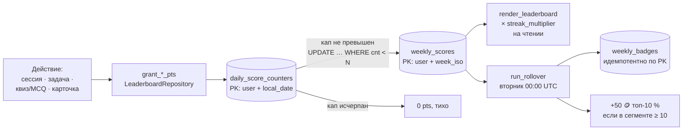

# Функциональность: пофичевая спецификация

> **Doc sync:** 2026-09-05 · поведение сверено с кодом на коммите `0ac30af`.

Продуктовое описание для пользователя — в [../README.md](../README.md),
клики и экраны — в [../user-flows.md](../user-flows.md). Здесь — точная
механика: константы, формулы, состояния, побочные эффекты.

## 1. Онбординг (`/start`)

Порядок в `cmd_start` ровно такой:

1. Из текста команды выделяется deep-link аргумент (`/start <arg>`) — до
   любых записей в БД, потому что он нужен ниже.
2. Если пользователя ещё нет — создаётся строка в `users` (сразу с
   `username`), пишется лог `user.registered` и событие `user_registered`
   с `language_code` из Telegram.
3. Если пользователь новый **или** у него пустой `users.locale` —
   показывается двуязычный inline-пикер языка
   (`SetupStates.choosing_language`). Выбор пишется в `users.locale`, и
   команды в `/`-пикере переустанавливаются под локаль. Иначе — приветствие
   «с возвращением» со статистикой и главная клавиатура.
4. После выбора языка предлагается «Начать сразу» или «Настроить
   напоминания» — FSM `SetupStates.choosing_path` → `setting_morning` →
   `setting_evening`, на каждом шаге доступен `/skip`.
5. **В самом конце**, уже после приветствия, обрабатывается deep-link
   `t.me/<bot>?start=friend_<token>`: валидный непросроченный токен сразу
   создаёт дружбу (событие `friend_accepted` с `source=invite_link`).
   Онбординговый FSM при этом не сбрасывается — инвайт остаётся
   побочным эффектом.

## 2. Pomodoro-таймер

| Параметр | Значение |
|----------|----------|
| Стандартная длительность | 25 мин |
| Кастомная | 5–120 мин (`TimerStates.waiting_for_duration`) |
| Монеты | 1 🪙 за минуту (`base_coins = duration`) |
| Потолок начисления | `min(duration, 120)` в `complete_session` |
| Досрочная остановка | «⏹ Стоп» или `/stop` — начисляется фактически отработанное время |

Состояние живёт в FSM (`TimerStates.active` + `start_time`, `duration`),
которое благодаря `SQLiteStorage` переживает рестарт — см.
[architecture.md](architecture.md) §«Восстановление таймеров».

Один активный таймер на пользователя: `_timer_completion_lock(user_id)` и
слот активной задачи защищают от двойного завершения. Переход в
«📖 Подготовка» из главного меню **не убивает** работающий таймер
(`_detach_timer_for_study_flow`) — учиться и считать время можно параллельно.

По завершении: начисление монет и бонусов, проверка ачивок, +XP питомцу,
`grant_time_pts` в лидерборд, запрос оценки сессии (4 эмодзи → `study_sessions.score`).

## 3. Режимы учёбы

Вход один: reply-кнопка **📖 Подготовка → предмет → режим**. Кнопка
объявлена под ключом `kb.quizzes` (историческое имя — раньше она называлась
«❓ Квизы»), сейчас её текст — «📖 Подготовка» / «📖 Prep»; отдельной кнопки
квизов в главном меню нет. Пустые предметы и режимы скрываются
автоматически (см. [architecture.md](architecture.md) §«Загрузка учебного
контента»).

**Что реально доступно из меню сейчас** (официальный контент, проверяется
`_file_based_mode_ids`):

| Предмет | Режимы с контентом | Виден в «Подготовке» |
|---------|--------------------|:--------------------:|
| `math` | задачи (71) | да |
| `accounting` | флэш-карты (67) | да |
| `industrial-management` | ситуационные, флэш-карты, MCQ, задачи (1) | **нет** — `PREP_HIDDEN_SUBJECT_IDS` |
| `english` | — | нет (нечего показывать) |

Отсюда следует неочевидное: **ситуационные квизы и MCQ сейчас недостижимы
на официальном контенте** — он есть только у скрытого ОПМ. Флэш-карты и
задачи дополнительно открываются пользовательским контентом (свои карточки
и импортированные задачи включают режим для любого предмета).

### 3.1 Ситуационные квизы (`situational`)

Открытый ответ, грейдер по ключевым словам (`check_text_answer`).
Интервалы повторения **фиксированные**: `QUIZ_INTERVALS = [1, 2, 4, 7]`
дней по текущему `streak`; неверный ответ → повтор завтра.
**Монеты за ситуационный квиз не начисляются** — только очки лидерборда
(5 pts + серийный бонус). Прогресс — `quiz_progress`.

### 3.2 Флэш-карты с SM-2 (`flashcards`)

Трёхкнопочный рейтинг → `quality`: «❌ Не знал» = 1, «😐 Сложно» = 3,
«✅ Легко» = 5. `services.sm2_update` — канонический SuperMemo-2:

```
quality < 3 → repetitions = 0, interval = 1
quality >= 3 → repetitions += 1
               interval = 1 (1-е), 6 (2-е), round(prev * EF) (далее)
EF += 0.1 − (5 − q) × (0.08 + (5 − q) × 0.02),  EF >= 1.3
```

Награда: **+1 🪙 за карточку при любом рейтинге** (`FLASH_COINS_PER_CARD`) —
честная самооценка ценнее максимизации монет.

Источник карточек настраивается в ⚙️ → 🃏 Флэш-карты:
`mix` (по умолчанию) / `official` / `own` (`notification_settings.flashcard_source`).
Свои карточки создаются через 📇 Мои карточки, до 100 на предмет.

### 3.3 MCQ (`mcq`)

4 варианта, порядок перетасовывается, вопросы в сессии перемешиваются
(`random.shuffle`). Награда: 1 🪙 за верный. Прогресс — `mcq_progress`
(`correct_count` / `total_count`). Для лидерборда MCQ считается квизом.

### 3.4 Задачи (`tasks`)

Официальные задачи — `task-NN.json` (+ опционально `task-NN.png`) или
`text_only: true` с полем `problem`. Свои — импорт `.txt`.

| Попытка | Что происходит | Награда |
|---------|----------------|---------|
| 1-я верная | Ответ принят | **3 🪙** |
| 1-я неверная | Показывается `hint`, если он есть; иначе «осталась 1 попытка» | — |
| 2-я верная | Ответ принят | **2 🪙** |
| 2-я неверная | Показывается ответ / `solution_text` / `task-NN-solution.png` | **0 🪙** |

Константы: `TASK_REWARDS_BY_ATTEMPT = [3, 2]`, `MAX_TASK_ATTEMPTS = 2`.
Сверка ответа — `task_answer_match.task_answer_matches`: дроби `a/b`,
десятичные с точкой и запятой, целые, плюс fallback на нормализованное
текстовое сравнение.

Если у предмета есть `groups.json`, перед сессией показывается inline-пикер
групп (название + количество задач).

## 4. Геймификация

### 4.1 Монеты

| Источник | Награда |
|----------|---------|
| Минута Pomodoro | 1 🪙 |
| MCQ — верный ответ | 1 🪙 |
| Ситуационный квиз — верный ответ | — (только очки лидерборда) |
| Флэш-карта (любой рейтинг) | 1 🪙 |
| Задача с 1-й / 2-й попытки | 3 🪙 / 2 🪙 |
| Ачивка | 25–125 🪙 |
| Продление стрика (со 2-го дня) | 15 🪙 |
| Первый просмотр совета за день | 1 🪙 |
| Top-10 % сегмента по итогам недели | 50 🪙 |

Траты: кастомизация питомца (20–240 🪙), заморозка стрика (500/750/1000 🪙).

### 4.2 Ачивки (`achievements.json`, 10 штук)

| ID | Условие | Награда |
|----|---------|--------:|
| `first_session` | 1 сессия | 25 |
| `3_day_streak` | 3 дня подряд | 50 |
| `10_sessions` | 10 сессий | 50 |
| `7_day_streak` | 7 дней подряд | 75 |
| `100_minutes` | 100 минут суммарно | 75 |
| `30_sessions` | 30 сессий | 75 |
| `10_tips_read` | 10 просмотров советов | 30 |
| `14_day_streak` | 14 дней подряд | 100 |
| `300_minutes` | 300 минут суммарно | 100 |
| `750_minutes` | 750 минут суммарно | 125 |

Английские названия — `achievements.en.json`. Прогресс — `user_achievements`;
выдача идемпотентна (`completed = 1` не переигрывается).
Отключается флагом `notification_settings.achievements_enabled`.

### 4.3 Стрик

Ночной прогон в 23:58–23:59 **локального** TZ пользователя:

- `has_studied_today = 1` → `current_streak += 1`, со 2-го дня +15 🪙,
  уведомление (если включено).
- `has_studied_today = 0` → сначала попытка израсходовать активную
  **заморозку** (`consume_freeze_if_active`), иначе `current_streak = 0`.
- `streak_enabled = 0` → флаг дня сбрасывается, стрик не трогается.

Идемпотентность — `users.last_streak_check_date`: повторный запуск в тот же
локальный день пропускается.

## 5. Цифровой питомец

- **XP:** 1 XP за минуту учёбы (`PetRepository.add_xp`, вызывается из
  `complete_session`). Питомец создаётся автоматически при первой сессии.
- **Уровень:** `level = floor(sqrt(xp / 10)) + 1`.
- **Эмоции — 3 штуки, не хранятся в БД**, выводятся в момент рендера
  (`services.derive_emotion`, приоритет сверху вниз):
  1. `joy` — идёт таймер **или** level-up/ачивка были ≤ 5 минут назад;
  2. `sad` — сегодня ещё не учился;
  3. `neutral` — всё остальное.
- **Суточные варианты арта** (`get_pet_time_period` по локальному часу):
  `morning` 06–12, `day` 12–17, `evening` 17–22, `night` 22–06.
> **Кастомизация выключена флагом.** `bot.PET_CUSTOMIZATION_ENABLED = False`:
> в экране питомца нет кнопок «🎨 Цвета» / «🎁 Аксессуары», строка
> «Цвет · Аксессуар» убрана из подписи, а все callback-хендлеры
> (`pet_colors`, `pet_accessories`, `pet_locked`, `pet_equip`, `pet_buy`,
> `pet_buy_do`) на первой же строке возвращают отказ. Экран питомца сейчас
> предлагает только «✏️ Переименовать» и «◀️ Профиль». Данные, каталоги и
> repo-методы при этом живые и покрыты тестами — включение это одна
> константа.

- **Каталоги** (`unlock_level`, цена 🪙) — актуальны для кода, но недоступны
  в UI, пока флаг выключен:

  | Цвет | | Аксессуар | |
  |------|--|-----------|--|
  | `orange` | lvl 1, бесплатно | `none` | lvl 1, бесплатно |
  | `grey` | lvl 1, 20 | `hat` | lvl 1, 30 |
  | `blue` | lvl 2, 40 | `glasses` | lvl 3, 90 |
  | `green` | lvl 2, 40 | `scarf` | lvl 5, 150 |
  | `pink` | lvl 4, 80 | `crown` | lvl 8, 240 |

- **Покупка** (когда флаг включён) атомарна: `purchase_item` сам берёт
  `db.lock`, перечитывает баланс и уровень под локом, `INSERT OR IGNORE`
  в `user_pet_inventory`.
- **Пикер кастомизации** — 4 состояния кнопки: ⭐ надето / ✓ куплено /
  💰 N доступно / 🔒 lv.N заблокировано, с диалогом подтверждения покупки.
  Код на месте, в UI скрыт (см. врезку выше).
- **Level-up уведомление** перечисляет, что именно открылось на новом
  уровне, — отправляется независимо от флага кастомизации.
- **Переименование** — FSM `PetStates.waiting_for_name`, доступно всегда.
- **Экран питомца** сейчас: фото (суточный `default.png`), имя, уровень,
  XP, текущая эмоция, баланс монет + две кнопки.
- Разрешение пути к ассету — `services.render_pet`, чистая функция
  (единственный I/O — `Path.exists()`).

> **Важно: сейчас включён режим одной картинки.**
> `services.PET_SINGLE_IMAGE_MODE = True`, и этот блок стоит в самом начале
> `render_pet`: если существует `assets/pet/<period>/default.png` (а он
> существует для всех четырёх периодов), функция возвращает его сразу.
> Значит **эмоция, цвет, аксессуар и флаг `animated` на картинку не влияют** —
> меняется только суточный вариант. Эмоция при этом продолжает работать в
> тексте: подписи, копия вечернего напоминания, выбор sad-ветки. Купленные
> цвета и аксессуары хранятся, отображаются в пикере и снова начнут менять
> изображение, как только флаг переключат в `False` или уберут
> `<period>/default.png`.

Полная цепочка фолбэков (работает при `PET_SINGLE_IMAGE_MODE = False`):

1. `<period>/default.png`, затем `assets/pet/default.png` — если режим одной
   картинки включён; иначе шаг пропускается.
2. `animated=True`: `<period>/<emotion>.gif` → `<emotion>.gif` → legacy-стемы
   (`happy`, `excited` для `joy`; `sleepy`, `studying` для `neutral`) →
   `neutral.gif` → `happy.gif`, иначе `FileNotFoundError`.
3. Статика: `<period>/<emotion>_<color>_<accessory>.png` →
   `<period>/<emotion>_orange_none.png` → `<period>/default.png` → те же
   имена в плоской `assets/pet/` → `neutral_orange_none.png` →
   `happy_orange_none.png` → `default.png` → `FileNotFoundError`.

- В вечернем напоминании тому, кто сегодня не учился, уходит sad-арт с
  подписью. Код запрашивает `render_pet(..., animated=True)` и **смотрит на
  расширение полученного файла**: `.png` → `send_photo`, иначе
  `send_animation`. В текущем режиме одной картинки это всегда `send_photo`.
  `FileNotFoundError` → graceful fallback на текстовое сообщение.

## 6. Недельный лидерборд

Продуктовая спека и баланс — [../LEADERBOARD.md](../LEADERBOARD.md).
Реализация:

```
weekly_score = (time_pts + task_pts + quiz_pts + card_pts) × streak_multiplier
```

Путь очка от действия пользователя до строки лидерборда — четыре разные
таблицы и два разных времени (локальное для набора, UTC для наград):



Ключевое следствие схемы: **дневные капы живут отдельно от недельной
суммы**. Новый день — новая строка `daily_score_counters`, поэтому счётчики
и серия квизов обнуляются сами, без ночной джобы. Множитель стрика в
`weekly_scores` не попадает: он применяется в момент чтения, поэтому
пользователь, продливший стрик, сразу видит пересчитанный результат за всю
неделю.

| Компонент | Начисление | Дневной кап |
|-----------|-----------|-------------|
| Время | кусочно-линейно: 1.00 / 0.75 / 0.50 / 0.25 pts за минуту в тирах 0–60 / 61–120 / 121–180 / 181–240 | 240 минут (сверх — 0) |
| Задачи | 40 pts за решённую | 5 задач |
| Квизы (вкл. MCQ) | 5 pts за верный + **15 pts** за каждые 3 подряд | 25 верных |
| Карточки | 3 pts за новую, 5 pts за повторную (quality ≥ 3) | 8 успешных |

Множитель стрика: ×1.00 (0–2 дня), ×1.05 (3–6), ×1.10 (7–13), ×1.20 (14+).
Не хранится — применяется на чтении.

**Сегменты:** `newbie` (`created_at` < 7 дней) и `main`; авто-роутинг, без
кнопок. Отображается топ-20 (`TOP_N_DISPLAY`), свой ранг дописывается ниже,
если не попал в топ.

**Rollover** — вторник 00:00 UTC (обоснование в
[architecture.md](architecture.md)): бэджи `top_1`/`top_2`/`top_3` в `main`,
`breakthrough` за 1-е место у `newbie`, и по 50 🪙 верхним 10 % сегмента —
но только если в сегменте ≥ 10 участников (`MIN_SEGMENT_FOR_TOP10_BONUS`),
иначе бонус обесценивается. Всё идемпотентно через PK `weekly_badges`.

**Privacy opt-out** (`users.hidden_from_leaderboards`): скрытый пользователь
не виден другим, но видит себя с пометкой «Вы скрыты», продолжает копить
очки и **сохраняет право на награды**.

**Заморозка стрика:** цена 500 (стрик ≤ 7), 750 (8–20), 1000 (21+) 🪙,
не чаще одной в 7 дней, покупка атомарна под локом.

## 7. Друзья

- Команда `/friends` или кнопка 👥 в профиле.
- Добавление по **@username** или **числовому Telegram ID**
  (`services.parse_friend_query`; ввод без `@` трактуется как username).
  `users.username` поддерживается актуальным `UsernameSyncMiddleware`.
- Заявка → accept / reject; удаление друга с подтверждением.
- `/share_friend` выдаёт multiuse deep-link со **сроком 3 дня**; клик
  создаёт дружбу мгновенно, минуя pending.
- Вкладка друзей ранжируется по недельному score.

## 8. Советы по продуктивности

Контент — `tips/*.json` (см. [content-authoring.md](content-authoring.md)).
Категории: ⏰ тайм-менеджмент (`tm`), 🧠 память (`mem`), 🎯 как пользоваться
ботом (`bot`), 🔗 ссылки (URL-кнопки).

- **Контекстный подбор** (`_preferred_tip_tags`): активен таймер → тег
  `timer`; сегодня ещё не учился → `study`, `focus`, `timer`, `bot`; есть
  карточки к повторению → `flashcards`. Если по приоритетным тегам что-то
  нашлось — выбираем из них, иначе из всего пула.
- **Cooldown 7 дней** (`user_tips_seen`); если пул исчерпан — показываем
  повторно (`pool or list(tips)` в `_pick_tip`). Листание «Все советы»
  тоже помечает советы как показанные, поэтому пользователь, пролиставший
  всю категорию, временно исчерпает её пул — и «🔄 Ещё совет» начнёт
  повторяться. Это осознанный размен: cooldown защищает от повторов, а не
  гарантирует новизну.
- **Совет дня** в утреннем напоминании: один `tip_id` на календарный день
  в TZ пользователя, `total_views` не увеличивает.
- **Геймификация:** +1 🪙 за первый просмотр в день, ачивка `10_tips_read`.
- **Листание ≠ просмотр:** `handle_tips_list` рендерит с
  `count_view=False`, поэтому ◀️/▶️ пишут только `user_tips_seen`
  (cooldown) и не трогают `total_views`, монету, ачивку и событие
  `tip_viewed`. «🔄 Ещё совет» (`tips:more`) считается полноценным
  просмотром. До 2026-09-05 листание считалось просмотром, и ачивку
  «Любознательный» можно было нафармить перелистыванием одной категории.

## 9. Профиль, прогресс и настройки

**Главное меню** (reply-клавиатура, раскладка `adjust(1, 1, 2, 1)`):

| Ряд | Кнопки |
|-----|--------|
| 1 | 📖 Подготовка (`kb.quizzes`) |
| 2 | 📚 Учебные инструменты (`kb.study`) |
| 3 | 📊 Мой профиль · ❓ FAQ |
| 4 | 📢 Новости |

Подменю «📚 Учебные инструменты»: 🎓 Советы · ⏱️ Стандартный таймер (25 мин) ·
⏱️ Кастомный таймер · 🏠 Назад в меню. Полная карта экранов и подсчёт
кликов — [../user-flows.md](../user-flows.md).

**Профиль:** заголовок со статистикой (имя и уровень питомца, монеты,
стрик, сессии) + семь inline-кнопок (`_build_profile_inline_keyboard`):
🏆 ачивки, ⚙️ настройки, 📊 прогресс, 🏆 рейтинг недели, 🐾 питомец,
👥 друзья, ❄️ заморозить стрик.

**📊 Прогресс по предметам:** на предмет — 10-квадратный mastery-bar
🟩⬜, «🔔 К повторению сегодня», «🕐 Активность», «📈 Заходов».
Mastery агрегируется из четырёх режимов по правилам из
[data-model.md](data-model.md) §«Прогресс по режимам учёбы».
Предметы из `PROFILE_COMING_SOON_SUBJECTS` (`english`,
`industrial-management`) показываются с пометкой «🚧 Контент в разработке».

**⚙️ Настройки** (порядок кнопок как в коде): утро вкл/выкл + «изменить
время», вечер вкл/выкл + «изменить время», уведомления о стрике,
уведомления об ачивках, 🌍 часовой пояс (**50 пресетов**, `TZ_PRESETS`),
👤 видимость в лидербордах, 🃏 источник флэш-карт (циклом
`mix → official → own`), язык, 📇 Мои карточки, 📄 Мои задачи, назад в
профиль.

## 10. Команды

Дефолтный `/`-пикер (`locale_bot.commands_for_locale`, 8 команд):
`/start`, `/stop`, `/progress`, `/pet`, `/leaderboard`, `/friends`,
`/share_friend`, `/delete_account`.

Есть, но в пикере не показываются: `/cancel` (выход из FSM-мастеров),
`/skip` (шаги онбординга), `/leaderboards` (алиас `/leaderboard`).

`/help` — **админская**: обычному пользователю отвечает подсказкой открыть
❓ FAQ или написать вопрос в чат.

Админских команд **21**: 17 доступны любому админу (`/help`, `/reply`,
`/broadcast`, `/notif_status`, `/analytics` и 12 остальных аналитических)
и 4 требуют совпадения с `MAIN_ADMIN_ID` — `/addadmin`, `/rmadmin`,
`/listadmins`, `/backup`. Все они есть в `/`-пикере админа
(`ADMIN_COMMANDS` = 8 пользовательских + 21 админская = 29 записей), но
проверка внутри хендлера решает, кто действительно получит ответ.
Справочник — [../admin_commands.md](../admin_commands.md).

## 11. Аккаунт и приватность

`/delete_account` — команда, затем inline-подтверждение («да, удалить» /
«отмена») и только после него удаление. Две ранние проверки: главный админ
(`user_id == MAIN_ADMIN_ID`) получает отказ и не может стереть себя через
бота, а пользователю без записи в БД сразу отвечают «данных нет».

Что именно стирается и что остаётся — [data-model.md](data-model.md)
§«Удаление данных пользователя»; юридическая формулировка —
[../PRIVACY.ru.md](../PRIVACY.ru.md) §8.

## 12. Спринт-план к экзамену (выключен)

`plan_service.py` генерирует 14-дневный план: каталог контента по темам,
входная диагностика (`diagnostic/default.json`) → бинарная карта навыков,
ротация режимов `flashcards → mcq → situational → tasks → mcq → flashcards`,
бюджет времени 60/120/180/240 мин в день → 8/16/24/32 элемента,
минимум 10 элементов в каталоге для генерации.

UI (`plan_handlers.py`) закрыт флагом **`PLAN_UI_ENABLED = False`** — хендлеры
не регистрируются в `main()`. Схема БД и 34 теста (`test_plan_service.py`,
`test_plan_repository.py`) при этом живые.
