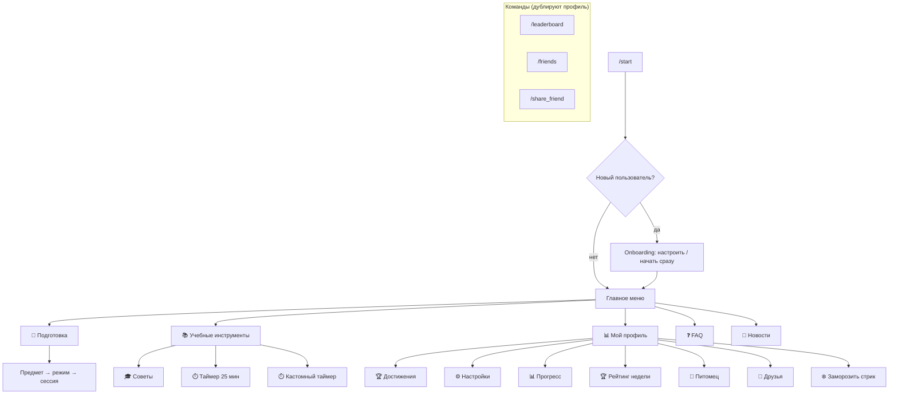
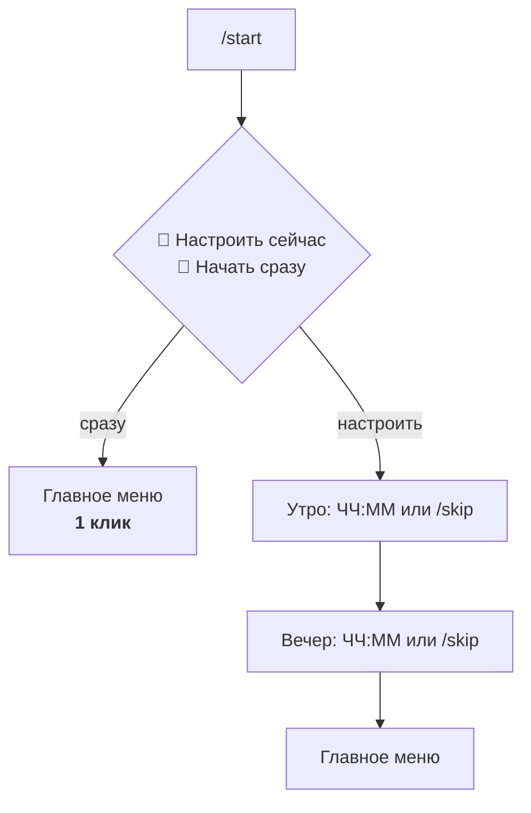
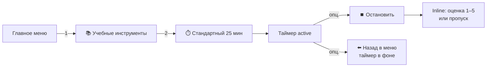
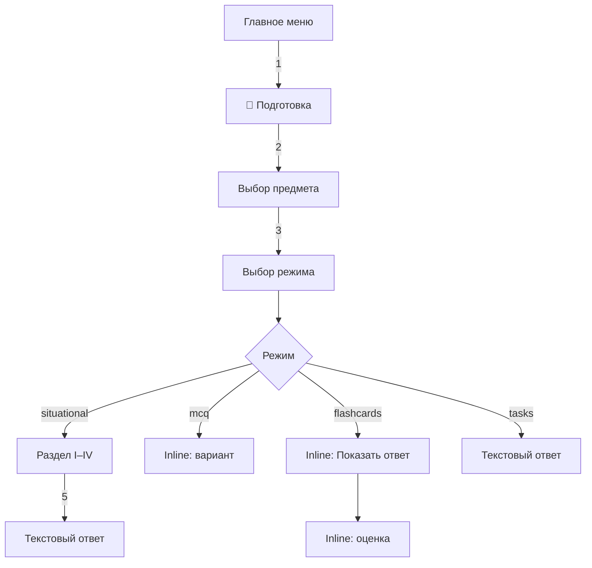
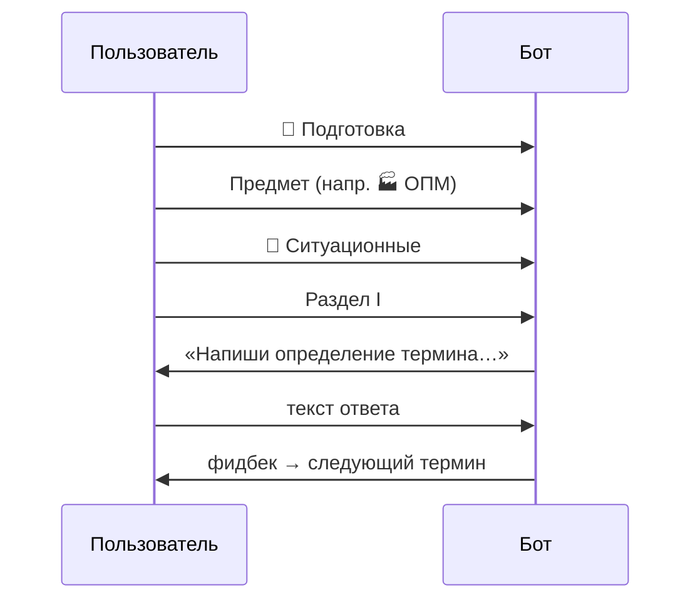
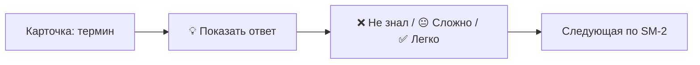
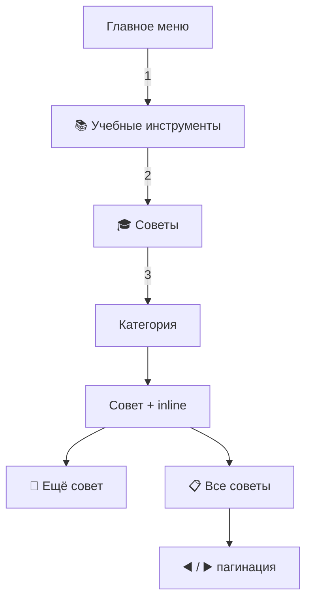
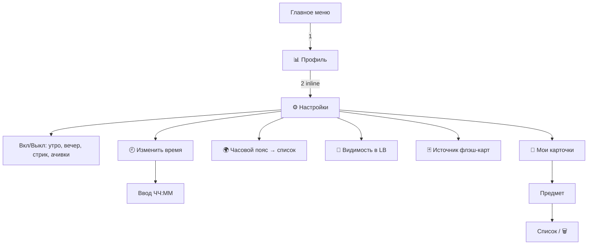
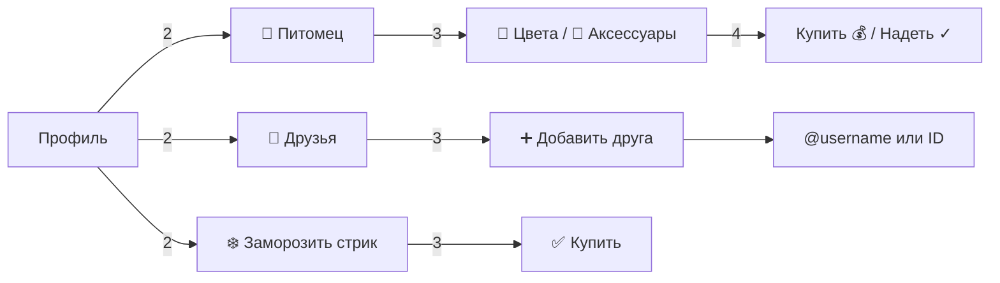
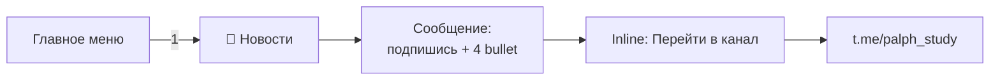

# User flows — Palph

Документ описывает стандартные пути пользователя в Telegram-боте Palph (v0.8) и считает клики до «полезного действия» — первого вопроса, запуска таймера, просмотра совета.

**Источник правды:** `bot.py` (клавиатуры, FSM, handlers).  
**Версия бота:** v0.8. **Тесты:** 732 (`pytest --collect-only -q`).  
**Дата:** 2026-05-25. **Статус:** living doc — обновлять при смене навигации.

---

## Как считаем клики

| Тип | Считается |
|-----|-----------|
| Reply-кнопка (нижняя клавиатура) | 1 клик |
| Inline-кнопка (под сообщением) | 1 клик |
| Текстовый ответ (определение, @username, ЧЧ:ММ) | отдельно: «+1 ввод», не UI-клик |
| Команда `/start`, `/stop`, `/leaderboard` | 0 кликов меню (но отдельное действие) |

«Полезное действие» — момент, когда пользователь реально учится или получает контент (таймер тикает, отвечает на вопрос, читает совет).

---

## 1. Карта приложения



### Главное меню (Reply, 1+1+2+1)

| Ряд | Кнопка | Действие |
|-----|--------|----------|
| 1 | 📖 Подготовка | Предмет → режим → сессия (отдельная строка сверху) |
| 2 | 📚 Учебные инструменты | Таймер Pomodoro + советы |
| 3 | 📊 Мой профиль · ❓ FAQ | Профиль / справка |
| 4 | 📢 Новости | Подписка на канал |

### Подменю «📚 Учебные инструменты» (Reply)

| Кнопка | Действие |
|--------|----------|
| 🎓 Советы для продуктивности | Категории советов |
| ⏱️ Стандартный таймер (25 мин) | Запуск Pomodoro |
| ⏱️ Кастомный таймер | FSM: ввод минут 5–120 |
| 🏠 Назад в меню | Главное меню |

---

## 2. Onboarding (первый /start)



| Путь | Клики | Ввод текста |
|------|-------|-------------|
| Начать сразу | 1 | — |
| Полная настройка | 1 + 0–2 шага | 0–2 раза ЧЧ:ММ или /skip |

Deep-link `?start=friend_<token>` обрабатывается после welcome — side effect, FSM onboarding не ломает.

---

## 3. Pomodoro (таймер)



| Путь | Клики до старта | После сессии |
|------|-----------------|--------------|
| Стандартный 25 мин | **2** | +1–2 inline (рейтинг), опционально push достижений |
| Кастомный | **3** | +1 текст (минуты) |
| /stop из любого экрана | 0 меню | то же, что ⏹️ Остановить |

**Заметки:** `/stop` во время MCQ/task/квиза **не** чистит чужой FSM (fix v0.7). «Назад в меню» во время таймера не останавливает сессию — только `/stop` или автозавершение.

---

## 4. Подготовка — общая цепочка

Текущий порядок (v0.8+): **📖 Подготовка → предмет → режим → (раздел / сессия)** — отдельная кнопка в главном меню.



### Режимы учёбы (`STUDY_MODES`)

| id | Кнопка | Контент |
|----|--------|---------|
| situational | 🎯 Ситуационные квизы | `situational/section-*.txt` |
| flashcards | 🃏 Флэш-карты | `flashcards.txt` + свои карточки |
| mcq | ❓ Тест с выбором ответа | `mcq.txt` |
| tasks | 📷 Задачи (фото или текст) | `tasks/task-*.json` [+ PNG]; опционально `groups.json` |

Предметы (`SUBJECTS`): 🏭 ОПМ, 🧮 Математика, 🇬🇧 Английский. В меню показываются только предметы с непустым контентом (`available_subjects`).

### Клики до первого задания

| Режим | Reply | Inline | Итого до 1-го вопроса |
|-------|-------|--------|----------------------|
| MCQ | **3** | 1 | **4** |
| Флэш-карты | **3** | 2 | **5** |
| Ситуационный | **4** | 0 | **4** + текст ответа |
| Задачи (фото/текст) | **3** | 0–1 (группы) | **3–4** + текст ответа |

### Extra UI после выбора предмета

Второе сообщение с inline **только когда нужно**:

| Когда | Inline |
|-------|--------|
| Уже есть **свои** карточки по предмету | ➕ Добавить карточку · 📇 Мои карточки (после выбора предмета) |
| Режим **🃏 Флэш-карты**, своих карт ещё нет | то же (один раз перед сессией) |
| MCQ / ситуационный / задачи, своих карт нет | **нет** лишнего сообщения |

Управление всегда доступно через ⚙️ Настройки → 📇 Мои карточки.

---

## 5. Ситуационный квиз



| Этап | Клики |
|------|-------|
| До первого термина | **4** reply |
| Следующий термин в том же разделе | **0** меню, только текст |
| Выход | 🛑 Завершить квиз → главное меню (1) |

Разделы I–IV показываются только если файл `section-*.txt` непустой (`available_quiz_sections`).

---

## 6. MCQ

| Этап | Клики |
|------|-------|
| До 1-го вопроса | **4** (3 reply + 1 inline) |
| Каждый ответ | 1 inline |
| Завершение сессии | 🛑 Завершить (1) → подменю учёбы |

Вопросы — 4 inline-варианта на сообщение; сессия идёт до конца списка или 🛑.

---

## 7. Флэш-карты (SM-2)



| Этап | Клики |
|------|-------|
| До 1-й карточки | **5** (3 reply + 2 inline) |
| Каждая карточка | **2** inline минимум |
| Источник карточек | Настройка ⚙️: mix / official / own |

Если карточек нет — сообщение с подсказкой + возврат к режимам предмета.

---

## 8. Задачи с картинкой

| Этап | Клики |
|------|-------|
| До 1-й задачи | **3** reply |
| Ответ | текст (до 3 попыток, затем solution image) |
| Награда | +3 / +2 / +1 🪙 по попытке |

---

## 9. Советы по продуктивности



| Категория (Reply) | id |
|-------------------|-----|
| ⏰ Тайм-менеджмент | tm |
| 🧠 Техники запоминания | mem |
| 🎯 Как пользоваться ботом | bot |
| 🔗 Ссылки на статьи и книги | links (URL-кнопки) |

| Путь | Клики до контента |
|------|-------------------|
| Случайный совет | **3** reply |
| Ещё совет | +1 inline |
| Список / листание | +2+ inline |

**Геймификация:** +1🪙/день за первый просмотр; ачивка «Любознательный» (10 советов). Known issue: пагинация «Все советы» инкрементит `total_views` — см. [TODO.md](TODO.md) #18.

**Параллельный канал:** «совет дня» в утреннем push (`build_morning_tip_block`) — 0 кликов.

---

## 10. Профиль и настройки



| Задача | Клики (типично) |
|--------|-----------------|
| Открыть настройки | **2** |
| Toggle уведомления | **3** |
| Сменить время утра/вечера | **4+** (+ текст) |
| Мои карточки → добавить | **4+** через настройки |

### Два входа в «Мои карточки»

1. **Профиль → ⚙️ Настройки → 📇 Мои карточки** (4+ клика)
2. **Квизы → предмет → inline ➕ / 📇** (3 клика до предмета + 1 inline)

Рекомендация при оптимизации: оставить один канонический путь.

---

## 11. Питомец, друзья, стрик



| Задача | Клики |
|--------|-------|
| Экран питомца | 2 |
| Покупка аксессуара | 4–5 (+ confirm) |
| Список друзей | 2 |
| Добавить друга | 3 + текст |
| Invite-link | `/share_friend` → share → друг жмёт link (вне меню) |
| Заморозка стрика | 3–4 |

**Лидерборд:** `/leaderboard` или **🏆 Рейтинг недели** в профиле. **Друзья:** `/friends` или **👥 Друзья** в профиле (invite-link внутри вкладки).

---

## 12. Новости (канал)



| Шаг | Клики | Примечание |
|-----|-------|------------|
| Открыть экран | **1** reply | `nav.news_body` (RU/EN в `locales/*.json`) |
| Перейти в канал | **1** inline | URL-кнопка, Telegram открывает канал |

**Содержание (RU):** новые функции, советы по продуктивности, лайфхаки для учёбы, эксклюзивные бонусы и конкурсы. Отдельного FSM нет — один ответ + клавиатура.

---

## 13. FAQ

10 тем (`faq.mission` … `faq.why_free`), RU/EN через `locales/*.json`.

| Шаг | Клики |
|-----|-------|
| ❓ FAQ | 1 reply |
| Тема вопроса | 1 inline |
| Назад к списку | 1 inline «◀️ К списку» |

---

## 14. Сводка: узкие места

Главный overhead — **ветка квизов**, не таймер и не профиль.

```
Главное → Подготовка → Предмет → Режим → [Раздел] → действие
   1        2        3          4        5?
```

Для returning user повторяется цепочка 3–4 reply-кликов каждый раз.

---

## 15. Идеи оптимизации (приоритет)

| # | Проблема | Сейчас | Идея | Экономия |
|---|----------|--------|------|----------|
| 1 | Лишний уровень для подготовки | ~~2 клика~~ | ✅ «📖 Подготовка» в главном меню | **−1** shipped |
| 2 | Нет «продолжить» | 4–5 каждый раз | `last_subject` + `last_mode` → «▶️ Продолжить MCQ · ОПМ» | −2…−3 |
| 3 | Ситуационный + раздел | 5 | «Продолжить раздел I» / SRS-default | −1 |
| 4 | Два входа в свои карточки | 3–4 vs 4+ | Один канонический путь | ясность UX |
| 5 | Inline после предмета | +2 кнопки всегда | ✅ только при своих картах / входе во флэш | shipped |
| 6 | Лидерборд | только команда | ✅ **🏆 Рейтинг недели** в профиле | shipped |
| 7 | Флэш: 2 tap/карта | 5 до старта | «Показать сразу» или одна кнопка оценки | −1/карта |
| 8 | Sprint-план (бэклог) | — | «📋 Сегодня» = 1–2 клика до плана дня | см. [BACKLOG.md](BACKLOG.md) |
| 9 | Задача в спринте | — | — | [TODO.md](TODO.md) #21 |

### Целевые метрики

| Flow | Сейчас | Цель после оптимизации |
|------|--------|------------------------|
| Pomodoro 25 мин | 2 | 2 (без изменений) |
| MCQ (returning) | 4 | 2–3 |
| Ситуационный ОПМ | 4 | 3–4 |
| Случайный совет | 3 | 1–2 |
| Настройки | 2 | 2 |

---

## 16. Связанные документы

| Файл | Связь |
|------|-------|
| [README.md](README.md) | Обзор продукта, быстрый старт |
| [TODO.md](TODO.md) | Задачи по UX (tips pagination #18) |
| [BACKLOG.md](BACKLOG.md) | Sprint / adaptive plan — сокращение «что учить» |
| [LEADERBOARD.md](LEADERBOARD.md) | Друзья, freeze, privacy |
| [tips/README.md](tips/README.md) | Поведение советов |

---

*При изменении клавиатур или FSM в `bot.py` обновляй этот файл.*
